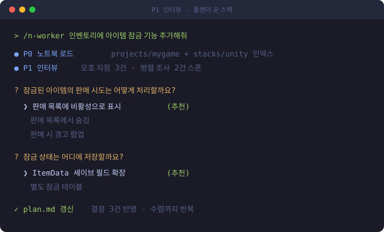
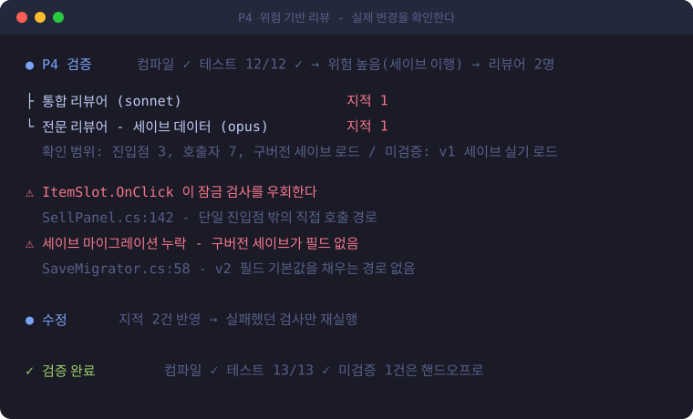
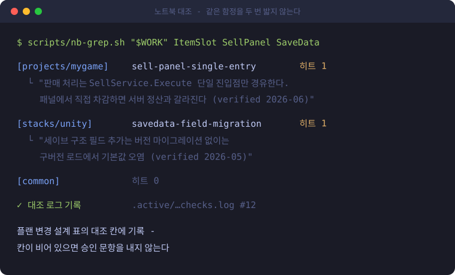
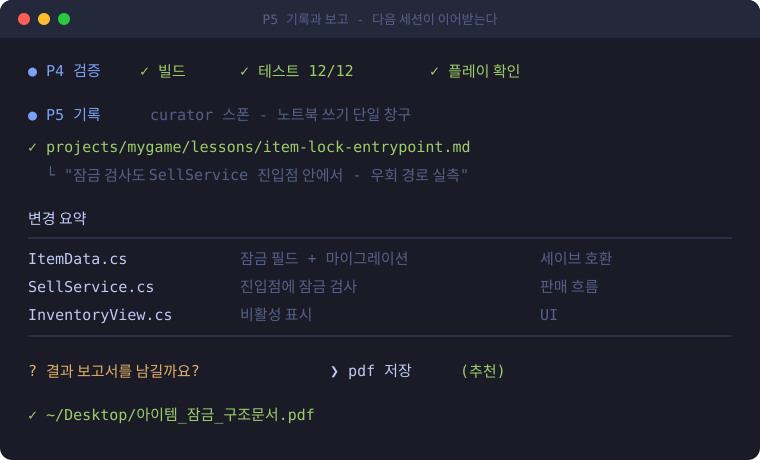
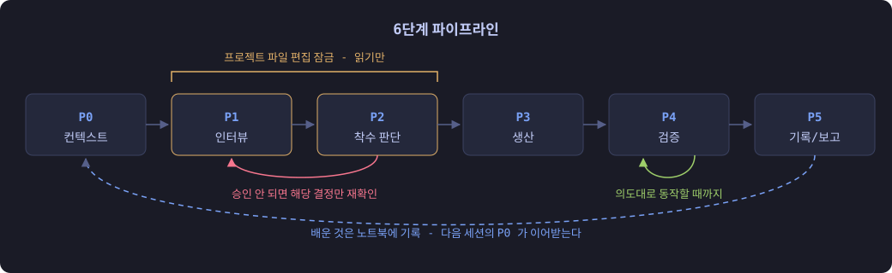
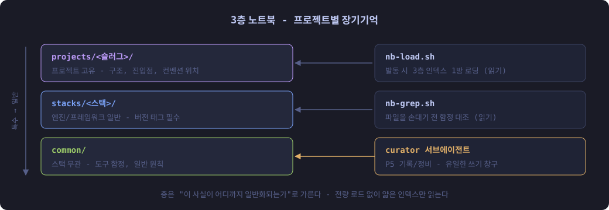

<h1 align="center">n-worker</h1>
<h3 align="center">make Claude Code remember!</h3>
<p align="center"><b>세션이 끝나도 프로젝트를 기억하고, 코드를 쓰기 전에 계획의 허점부터 찾는<br>Claude Code 코드 작업 스킬</b><br>
매 세션을 백지에서 시작하는 대신, 지난 세션이 배운 것 위에서 시작한다.</p>

<p align="center">
  <a href="LICENSE"></a>
  <a href="https://claude.com/claude-code"></a>
  
  
</p>

```bash
git clone https://github.com/FuJiGraphics/n-worker.git ~/.claude/skills/n-worker
```

<table align="center">
  <tr>
    <td width="50%" align="center">
      <br>
      <sub><b>의도가 확정된 뒤에만 코드를 쓴다.</b><br>모호한 지점은 추천안과 함께 질문하고, 합의는 플랜 파일에 쌓인다.</sub>
    </td>
    <td width="50%" align="center">
      <br>
      <sub><b>코드를 쓰기 전에 검토한다.</b><br>관점을 나눠 맡은 서브에이전트들이 플랜을 적대적으로 리뷰한다.</sub>
    </td>
  </tr>
  <tr>
    <td width="50%" align="center">
      <br>
      <sub><b>같은 함정을 두 번 밟지 않는다.</b><br>파일을 손대기 전, 과거에 밟았던 함정을 자동으로 대조한다.</sub>
    </td>
    <td width="50%" align="center">
      <br>
      <sub><b>다음 세션이 이어받는다.</b><br>배운 것은 뒤에서 노트북에 정리되고, 보고서까지 남기고 끝난다.</sub>
    </td>
  </tr>
</table>

n-worker 는 무거운 코드 작업(기능 추가, 리팩토링, 설계가 필요한 버그수정)을 위한 대화형 파이프라인이다.
인터뷰로 의도를 확정하고, 플랜 파일을 사용자와 함께 갱신하고, 코드를 쓰기 전에 적대 리뷰로 계획의 허점을 찾고,
생산, 검증, 기록까지 끝낸다. 그 과정에서 배운 것은 **3레이어 노트북**에 남아,
다음 세션의 Claude 가 프로젝트의 구조, 컨벤션, 함정을 이미 아는 상태로 시작하게 한다.

## 왜 필요한가

Claude Code 로 무거운 작업을 하다 보면 반복되는 문제가 있다:

| 문제 | n-worker 의 해결 |
|---|---|
| 매 세션이 백지에서 시작한다 - 프로젝트 설명을 반복하거나, 빼먹어서 사고가 난다 | **3레이어 노트북** - 확인된 사실만 쌓고 다음 세션이 자동으로 읽는다 |
| 모호한 요청을 임의로 해석해서 만든 결과물은 재작업이 된다 | **인터뷰** - 추천안과 함께 질문하고 플랜 파일로 합의를 고정 |
| 구조 위반, 중복 구현, 놓친 회귀는 코드가 쌓인 뒤에 발견되면 비싸다 | **사전 적대 리뷰** - 코드를 쓰기 전에 관점별 리뷰로 허점을 찾는다 |
| 긴 세션은 같은 내용이 매 턴 다시 전송되며 비용이 샌다 | **컨텍스트 절약** - 인덱스 점진 로딩, 서브에이전트 위임, 결과는 파일로 받고 압축해 읽기 |
| 지식 정리가 세션을 붙잡는다 - 기록이 끝나길 기다리거나 결과를 읽느라 토큰을 쓴다 | **curator 데몬** - 세션은 큐에 넣고 잊는다. 별도 프로세스가 뒤에서 정리한다 |

## 빠른 시작

```bash
git clone https://github.com/FuJiGraphics/n-worker.git ~/.claude/skills/n-worker
```

Claude Code 세션에서 프로젝트 폴더를 열고:

```
/n-worker 인벤토리에 아이템 잠금 기능 추가해줘
```

처음 실행할 때 프로젝트 등록 질문(슬러그, 스택, 컨벤션 문서 위치)에 답하면 노트북 골격이 만들어지고,
다음 세션부터는 자동으로 읽힌다.

> [!NOTE]
> 단순 질문이나 한 줄 수정에는 쓰지 않는다. 의도 확인과 검증에 여러 번 왕복할 가치가 있는
> 무거운 작업 전용이다.

## 동작 방식 - 6단계 파이프라인

<p align="center">
  
</p>

| 단계 | 하는 일 |
|---|---|
| **P0 컨텍스트** | 노트북 로드, 프로젝트 식별, 작업 무게 확인 |
| **P1 인터뷰** | 질문, 답, 플랜 갱신, 병렬 조사를 의도가 확정될 때까지 반복 |
| **P2 사전 리뷰** | 난이도 판정 → 관점별 적대 리뷰 → 취합 → 플랜 승인 |
| **P3 생산** | 복제 후 적응 - 기존 구현을 본떠 차이만 바꾼다. 큰 묶음은 서브에이전트에 위임 |
| **P4 검증** | 자동 검증을 의도대로 동작할 때까지 반복. 로그는 발췌만 읽는다 |
| **P5 기록과 보고** | 배운 것을 curator 큐에 넣는다(정리는 뒤에서) → 변경 요약 표 → (선택) pdf/html 보고서 |

핵심 설계 결정:

- **P1~P2 편집 잠금.** 플랜이 승인되기 전에는 프로젝트 파일을 읽기만 한다. 코드가 먼저 쌓이는 사고를 구조적으로 막는다.
- **리뷰는 코드를 쓰기 전에 한 번.** 생산 후 정적 리뷰가 없는 대신, 리뷰 대상이 "쓸 코드"가 되도록 파일별 변경 계획과 코드 초안을 플랜에 먼저 적는다.
- **복제 후 적응이 생성보다 우선.** 처음부터 새로 짜지 않고 그 프로젝트에서 가장 가까운 기존 구현을 본뜬다. 컨벤션은 저절로 따라온다.
- **읽은 것만 사실로 친다.** 노트북도 과거에 검증된 기록일 뿐이라, 동작을 바꾸기 전에는 실제 코드로 다시 확인한다.
- **서브에이전트 결과는 파일로 받는다.** Workflow 는 건수만 돌려주고 전문은 `scripts/wf-summarize.py` 로 압축해 읽는다. 전문을 그대로 받으면 메인 컨텍스트에 통째로 쌓이고 긴 결과는 잘린다.
- **하네스에 기댄 동작은 목록으로 관리한다.** 문서에 없는 Claude Code 동작에 기댄 곳은 `notebook/common/harness-routing.md` 에 항목별로 적는다(가정, 사용 위치, 근거, 깨졌을 때). `nb-load` 가 하네스 버전이 바뀐 것을 감지하면 한 줄 알리고 curator 가 재검증한다. 스킬이 하네스 업데이트에 조용히 깨지지 않게 하는 장치다.

## 3레이어 노트북 - 장기 기억의 구조

<p align="center">
  
</p>

- 레이어는 "이 사실이 어디까지 일반화되는가"로 가른다. 프로젝트 고유 사실은 `projects/`, 엔진/프레임워크 일반은 `stacks/`, 스택과 무관한 함정은 `common/`.
- **쓰는 주체는 하나다.** 기록, 레이어 승격/강등, 정비는 curator 만 한다. 주체가 하나여야 규칙이 갈라지지 않는다.
- **기록 기준.** 조사 비용을 치르고 알아낸 것, 사용자가 말해줘야만 알 수 있는 것만 기록한다. 코드를 열면 몇 초 만에 확인되는 것은 기록하지 않는다.
- **한 번에 다 읽지 않는다.** 얇은 인덱스만 읽고 본문은 이번 작업에 관련될 때만 펼친다. 같은 본문은 세션당 한 번만 보여 준다.
- 노트북은 설치한 기기에서 자란다. `.gitignore` 가 누적 지식을 추적에서 빼므로 개인 프로젝트 정보가 저장소에 섞이지 않는다.

## curator - 뒤에서 도는 기억 정리

노트북 기록은 세션이 직접 하지 않는다. 사람이 자기 기억이 어떻게 정리되는지 모르듯, 세션은 기록 요청을 큐에 넣고 잊는다.

```
세션 A ─┐
세션 B ─┼─ curator-enqueue.sh ─▶ notebook/.curator/queue/  ─▶ curator-daemon.sh (프로세스 1개) ─▶ 항목마다 claude -p ─▶ 노트북
세션 C ─┘
```

- **세션과 독립된 프로세스**다. 세션이 닫혀도 남은 큐를 마저 처리하고, 큐가 비면 스스로 종료한다.
- **동시에 여러 세션이 넣어도 하나만 돈다.** 잠금 파일로 단일 실행을 보장하고, 뒤에 들어온 요청은 큐에 쌓인다. 노트북에 쓰는 주체가 기계적으로 하나뿐이라 충돌이 없다.
- **말하지 않는다.** 진행 보고나 요약을 출력하지 않고 도구 호출만 한다. 결과는 세션에 전달되지 않으며, 실패했을 때만 다음 세션 시작 때 한 줄 뜬다.
- 모델은 `opus`(`notebook/common/model-routing.md` 에서 읽으므로 세대가 바뀌어도 그 파일만 고친다). 하위 서브에이전트는 쓰지 않는다 - 헤드리스에서 서브의 권한 상속이 문서화되지 않았고 실측에서 거부됐다.

### 기기마다 한 번: 데몬 쓰기 권한

이 스킬을 `~/.claude/skills/` 아래에 설치하면 노트북도 그 아래에 놓인다. Claude Code 는 `.claude/` 를 protected path 로 취급해 파일 편집마다 사람의 승인을 요구하는데, 데몬은 `claude -p` 로 도는 비대화형 프로세스라 승인할 사람이 없다. 그래서 **기본 상태에서 데몬은 판정만 하고 기록을 못 하며, 결과가 `denied` 로 남는다.**

켜려면 그 기기에서 한 줄 실행한다(설치할 때마다 한 번, 저장소에는 안전한 기본값이 들어 있다):

```bash
echo bypassPermissions > ~/.claude/skills/n-worker/scripts/curator-perm.mode
```

이 설정은 **curator 데몬 프로세스에만** 적용되고, 사용자의 대화 세션 권한은 건드리지 않는다. 데몬 쪽 범위는 따로 좁혀 둔다: 도구를 Read, Write, Edit, Grep, Glob, Bash 로 한정하고, git 쓰기 명령과 `rm`, `sudo` 는 거부 규칙으로 막고(거부 규칙은 이 모드에서도 유효하다), MCP 서버를 붙이지 않고, 프로젝트 폴더는 읽기 전용으로 넘긴다. 켜지 않은 기기에서도 스킬의 나머지는 정상 동작한다 - 노트북에 새 기록이 쌓이지 않을 뿐이다.

기록을 자동화하지 않고 승인을 유지하고 싶으면 파일을 그대로 두면 된다. `scripts/curator-ctl.sh results` 에 curator 의 판정이 남으므로, 내용을 보고 직접 반영할 수 있다.

```bash
scripts/curator-ctl.sh status    # 데몬 상태, 큐 길이, 현재 항목
scripts/curator-ctl.sh results   # 사람이 원할 때만 결과 열람
scripts/curator-ctl.sh stop      # 현재 항목이 끝나면 종료
```

## 선택 설정 - 노트북 게이트 (PreToolUse 훅)

"파일을 고치기 전에 노트북을 대조한다"를 스킬 지시가 아니라 하네스 수준에서 강제할 수 있다.
`~/.claude/settings.json` 에:

```json
{
  "hooks": {
    "PreToolUse": [
      {
        "matcher": "Edit|Write|MultiEdit|NotebookEdit",
        "hooks": [
          {
            "type": "command",
            "command": "bash \"$HOME/.claude/skills/n-worker/scripts/nb-gate.sh\"",
            "timeout": 10
          }
        ]
      }
    ]
  }
}
```

- `scripts/nb-gate.mode` 가 `shadow` 면 기록만 하고 막지 않는다(기본값). `block` 으로 바꾸면 대조 기록 없는 프로젝트 파일 수정이 거부된다.
- 게이트는 n-worker 세션만 검사한다. `nb-load` 가 세션 id(`CLAUDE_CODE_SESSION_ID`)를 마커에 적고, 훅은 그 id 와 정확히 맞는 세션의 편집만 판정한다. 다른 세션의 편집은 기록도 남기지 않는다.
- 훅 없이도 스킬은 동작한다 - 게이트는 규율의 보험이다. `jq` 가 없으면 조용히 통과한다.

## 폴더 구조

```
n-worker/
├── SKILL.md               # 진입점 - 파이프라인 본문과 준칙
├── references/            # 단계별 상세 절차 (점진 로드)
│   ├── interview.md       #   P1 인터뷰, 질문 설계, 수렴 판정
│   ├── plan.md            #   플랜 파일 포맷
│   ├── review.md          #   P2 난이도 판정, 렌즈 카탈로그
│   ├── produce.md         #   P3 복제 후 적응, 위임 명세
│   ├── verify.md          #   P4 검증, 로그 판독, 핸드오프
│   └── report-render.md   #   html/pdf 보고서 규격
├── agents/
│   ├── curator.md         # 노트북 쓰기 전담 (등록/기록/정비) - 데몬이 항목마다 읽힌다
│   └── reporter.md        # 결과 보고서 생성 서브
├── scripts/
│   ├── nb-load.sh         # P0 노트북 로더 (registry + 3레이어 인덱스를 한 번에)
│   ├── nb-grep.sh         # 함정 대조 (3레이어 인덱스 grep + 히트 본문 동봉 + 로그)
│   ├── nb-gate.sh         # PreToolUse 게이트 (선택)
│   ├── curator-enqueue.sh # 기록 요청을 큐에 넣고 데몬이 없으면 띄운다
│   ├── curator-daemon.sh  # 큐를 순서대로 처리하는 독립 프로세스
│   ├── curator-perm.mode  # curator 데몬의 권한 모드 (한 단어)
│   ├── curator-ctl.sh     # 데몬 상태 확인, 결과 열람, 중지
│   ├── wf-summarize.py    # Workflow 결과(journal) 압축 판독
│   └── open-artifact.sh   # 산출물 열기 (md 를 에디터로)
├── notebook/              # 장기 기억 (시드 골격 - 설치 후 여기서 자란다)
│   ├── common/harness-routing.md  # 이 스킬이 기댄 하네스 동작 목록 (버전 변경 시 재검증)
│   └── .curator/          #   큐, 잠금, 로그 (런타임 상태, 추적 안 함)
└── assets/                # html 보고서 템플릿
```

## 요구사항

| 항목 | 내용 |
|---|---|
| [Claude Code](https://claude.com/claude-code) | 스킬, 서브에이전트, `AskUserQuestion` 지원 버전 |
| 셸 | bash (macOS / Linux 검증, Windows 는 Git Bash). 스크립트는 `python3` 이 없으면 `python` 을 쓴다 |
| `claude` CLI | curator 데몬이 `claude -p` 로 실행되므로 PATH 에 있어야 한다 |
| `jq` | 노트북 게이트(선택 설정)만 쓴다. 없으면 게이트는 조용히 통과한다 |
| 언어 | 스킬 본문과 진행 대화가 한국어다. 영어 환경에서도 동작하지만 질문과 플랜이 한국어로 나온다 |

## License

[MIT](LICENSE) - 수정과 재배포는 자유이며, 저작권 표시를 유지해 주세요.
